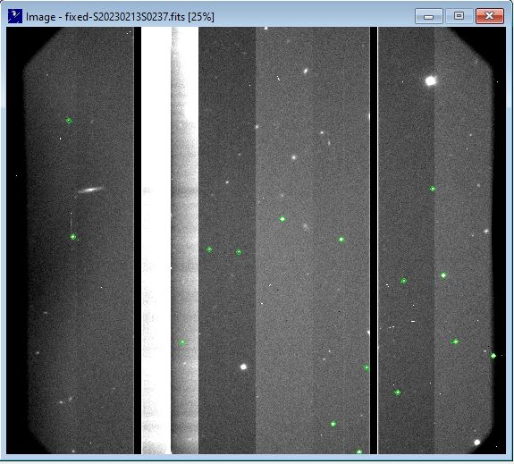

# Gemini-North-Flatten

A small program for assembline raw Gemini North data into a single fits file for programs like astrometrica or tycho-tracker.

usage: fixgem.py 'dir' -prefix 'prefix'

This will assembling the data channels and flattn the image into a single data channel fits preserving the image gaps. They can then be solved in astrometrica. It does a few other tweaks to fix the time and sky location.
